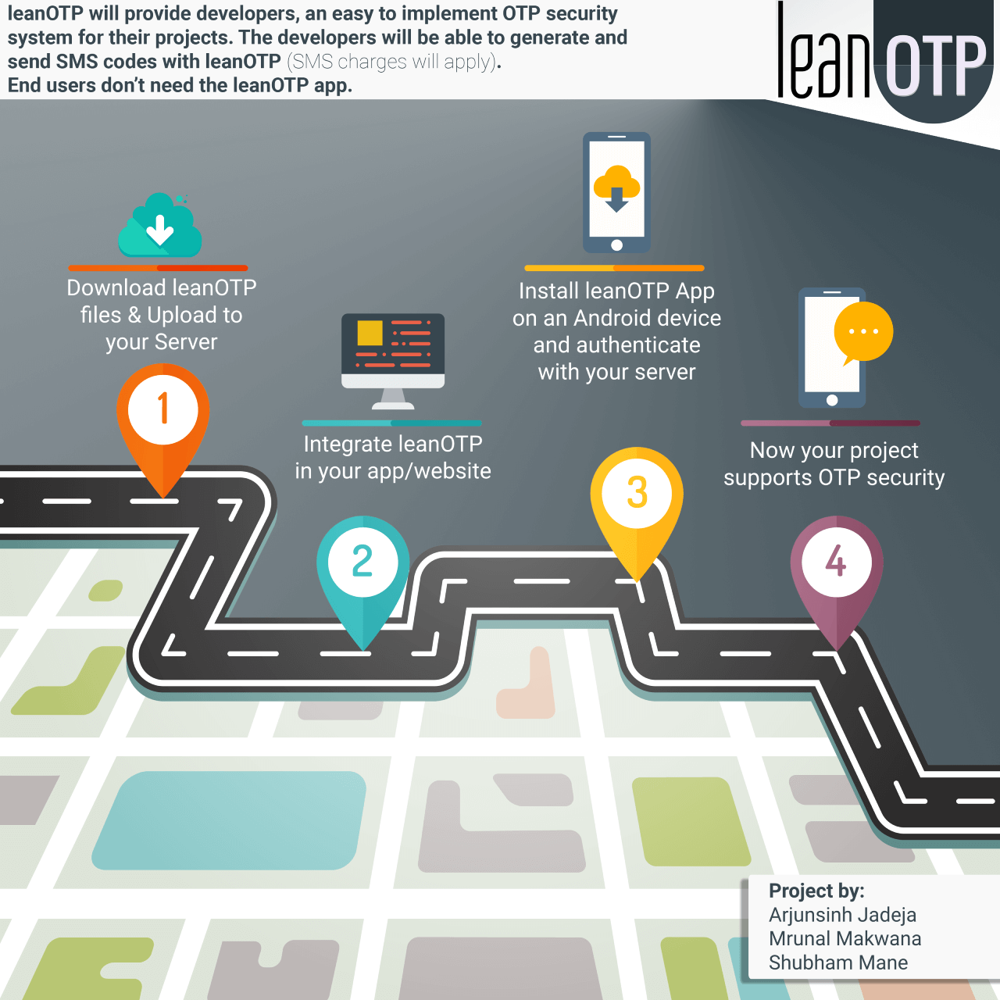
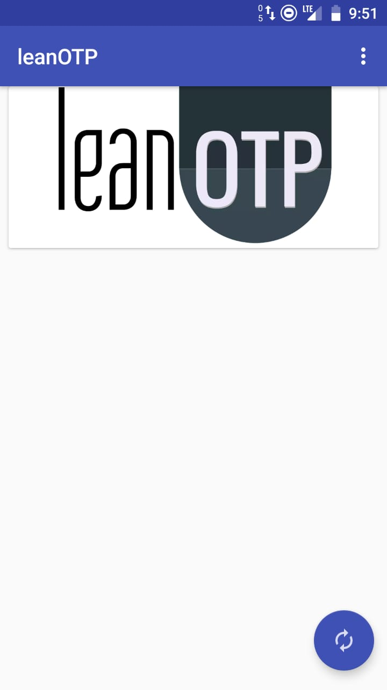
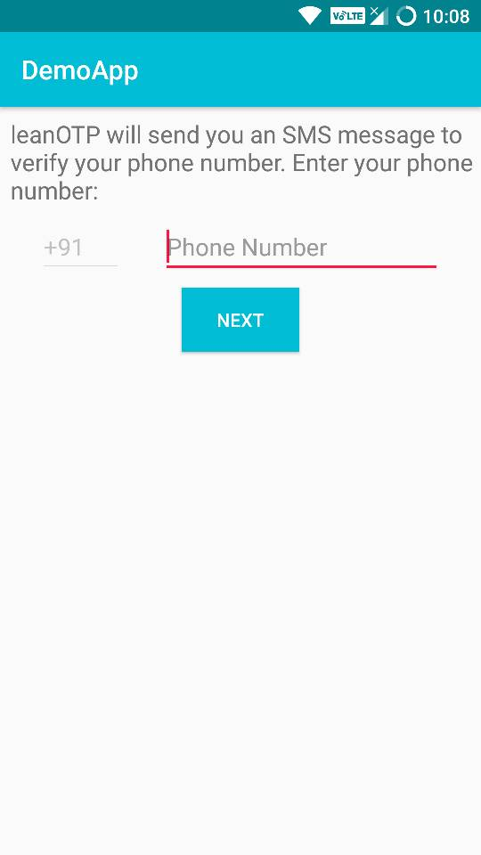
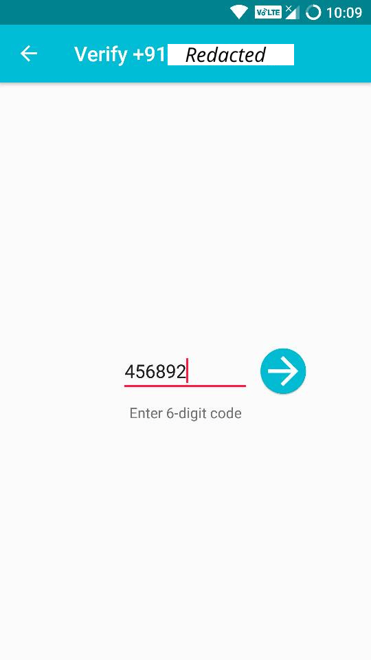

# leanOTP Android

### University Project | Submitted: April **2018**

leanOTP is a self hosted SMS based two-factor authentication system that utilises personal phones for sending one-time passwords. It is envisioned as drop-in security solution that can be integrated into projects of all sorts.

There are two components:
1. [leanOTP Web](https://github.com/itsarjunsinh/leanOTP-web) handles requests from client side app. It shares the user phone numbers with the leanOTP app in developer's phone.
2. leanOTP Android App will send OTP to the user via SMS from the built-in SIM card in the developer's phone.  

This is a proof of concept, some of the bugs and quirks are:
1. App doesn't automatically check server for new OTP requests.
2. Validation isn't completely implemented.

### leanOTP Android App

This app is to be installed on the developer's device. The refresh button checks the server to see if a user has requested OTP (auto-refresh isn't implemented). 

### Example App using leanOTP

This demo app shows the usual flow of logging in with SMS OTP.

## Links
[Watch Demo](https://www.youtube.com/watch?v=GkWdumLb7yQ)

The project report is available to students upon request.

## License

This project is licensed under the [MIT License](LICENSE). 